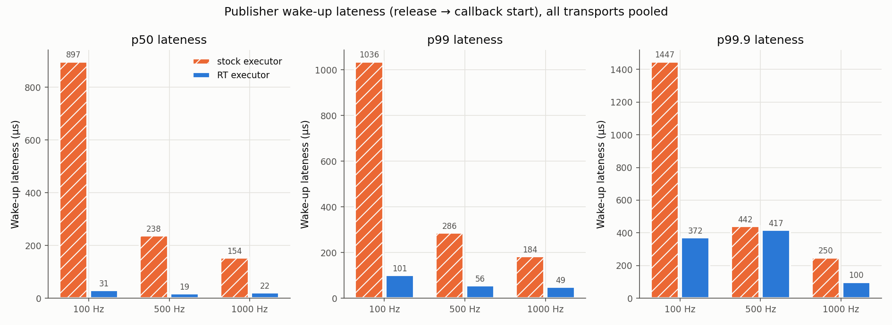
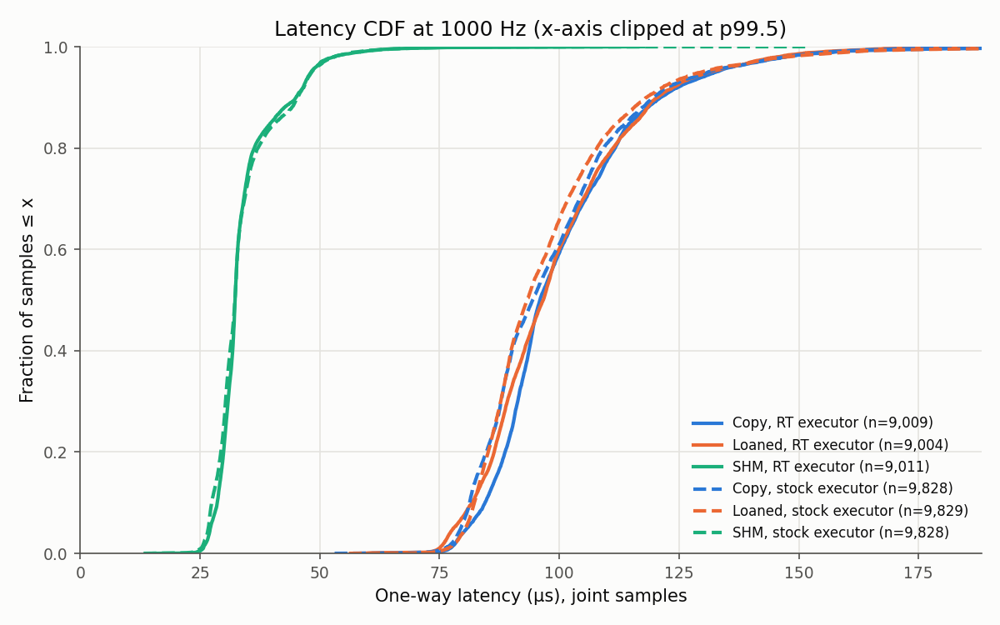

# ROS2 Real-Time Middleware — Custom Executor & Latency Benchmarking Suite

[](https://github.com/Mandar117/ros2_rt_middleware/actions/workflows/ci.yml)

A ROS 2 Humble middleware component in C++20 for deterministic periodic
work. It includes:

- **Real-time executor.** Periodic release on absolute deadlines, a lock-free
  callback queue, CPU pinning, `SCHED_FIFO`, and minimal timer slack.
- **Two zero-copy-capable transports.** Loaned messages over fixed-size types,
  and a POSIX shared-memory channel with seqlock slots and futex wake-up.
- **A benchmark suite.** It measures the RT executor against the stock
  `rclcpp` executor on the same workload, in-process and cross-process, idle
  and under CPU load.

---

## Results at a glance

Measured on **WSL2 (Ubuntu 22.04, kernel 6.18, 4 vCPU), ROS 2 Humble,
Fast DDS**. All numbers below are for this environment:

- **No `SCHED_FIFO`.** WSL2 sets `rtprio = 0`, so the RT executor ran with
  normal scheduling.
- **No `PREEMPT_RT` kernel.**
- **No loans.** Fast DDS did not grant loans for these types here, so Loaned
  mode fell back to a copy (the benchmark reports this per run).

The full tables are in [`results/`](results/), and each run's environment is
recorded in its `env.txt`.

### 1. Publisher wake-up lateness: RT executor vs stock executor

This is the time from a scheduled release to the start of the publish
callback (in-process, idle, all transports pooled).

| Rate | Stock `rclcpp` timer p50 / p99 | RT executor p50 / p99 | Stock achieved rate |
|---:|---:|---:|---:|
| 100 Hz  | 897 / 1036 µs | **32 / 101 µs** | 109.0 Hz |
| 500 Hz  | 238 / 286 µs  | **19 / 56 µs**  | 545.4 Hz |
| 1000 Hz | 154 / 184 µs  | **22 / 49 µs**  | 1090.9 Hz |



The stock timer is both late and fast. The cause, measured:

- rcl schedules timers on `CLOCK_MONOTONIC_RAW`, but waits on
  `CLOCK_MONOTONIC`. Under WSL2 the two clocks differ by up to **9.1%**
  (`clock_raw_vs_mono_ppm=90906` in [env.txt](results/wsl2_idle/env.txt)).
- So every wait overshoots by about 9% of the period, and a "1 kHz" timer
  fires 1091 times per real second.
- The RT executor schedules and sleeps on the same clock
  (`clock_nanosleep(TIMER_ABSTIME)` on `CLOCK_MONOTONIC`), so it is immune.

On bare metal the clock skew is a few ppm and the stock numbers would shrink
to their scheduling component. The other RT-executor gain is timer slack:
the executor drops it from the 50 µs default to 1 ns.

### 2. One-way message latency by transport

These are cross-process runs (separate publisher and subscriber processes),
idle, RT executor, 96-byte joint samples:

| Transport | 100 Hz p50 / p99 | 500 Hz p50 / p99 | 1000 Hz p50 / p99 |
|---|---:|---:|---:|
| Copy (DDS)        | 194 / 301 µs | 110 / 194 µs | 96 / 158 µs |
| Loaned (fallback) | 164 / 285 µs | 109 / 195 µs | 97 / 155 µs |
| **SHM channel**   | **49 / 82 µs** | **34 / 61 µs** | **32 / 59 µs** |



### 3. Under CPU load

These are in-process runs, RT executor, with 4 background threads streaming
8 MB buffers and churning the allocator on a 4-vCPU machine:

| Transport, 1000 Hz | p50 | p99 | p99.9 |
|---|---:|---:|---:|
| Copy (DDS)      | 76 µs | 3932 µs | 5276 µs |
| Loaned (fallback) | 73 µs | 3204 µs | 5019 µs |
| **SHM channel** | **8 µs** | **42 µs** | **96 µs** |

The DDS path's tail explodes because Fast DDS delivers through its own
receive threads, which compete with the load. The SHM reader is woken
directly by the publisher's futex.

The executor's wake-up p99 also degrades under load, to about 1.9 ms at
1 kHz. That is the expected result **without `SCHED_FIFO`**: a normal-priority
thread cannot pre-empt the load. Re-running on a host that grants RT priority
is the next step (see [Running on real RT hardware](#running-on-real-rt-hardware)).

### Honest notes

- **The executor changes when you publish, not how fast the transport
  delivers.** Message latency is the same under both executors (see the CDF
  above). The executor's value is release precision.
- **The second message of each cycle shows lower latency.** The cloud sample
  is about 26 µs vs 52 µs for the joint sample in Copy mode at 1 kHz. The
  joint sample pays to wake the subscriber thread; the cloud sample arrives
  while that thread is already awake.
- **Samples before discovery aren't counted as lost.** "Lost" means
  sequence gaps *after* the first received sample. Samples published before
  cross-process DDS discovery completes are not counted.
- **These results replace an earlier run (May 2026).** That run's
  subscriber polled with a 200 µs sleep that dominated its latency numbers,
  and its "SHM" mode was a stub that still went through DDS.

---

## Architecture

```
┌──────────────────────────────────────────────────────────────────────────┐
│ benchmark_runner · latency_publisher · latency_subscriber · scripts/     │  application
├──────────────────────────────────────────────────────────────────────────┤
│ RTExecutor              LatencyPublisher / LatencySubscriber   CsvLogger │  middleware
│  periodic task:          Copy   — publish(const&)                        │
│   clock_nanosleep(ABS)   Loaned — borrow_loaned_message()                │
│  one-shot queue:         SHM    — ShmChannelWriter / Reader              │
│   SPSC ring + pool        (seqlock slots + process-shared futex)         │
├──────────────────────────────────────────────────────────────────────────┤
│ LockFreeRingBuffer<T,N> · MemoryPool<T,N> · SampleSet (no-alloc stats)   │  primitives
└──────────────────────────────────────────────────────────────────────────┘
```

### RTExecutor

```
spin():  pin core · SCHED_FIFO/RR · timerslack=1ns · mlockall (optional)
loop:
  drain one-shot queue (bounded)        ← enqueue() from any thread
  if now ≥ next_release:
      record lateness = now − next_release      ← wake-up jitter
      next_release += period  (skip past releases, rcl-compatible)
      periodic_fn()
  else sleep until next_release (clock_nanosleep TIMER_ABSTIME) or busy-wait
```

### SHM channel

```
Publisher process                                Subscriber process
  slot = ring[i % 64]                              futex_wait(word)  ◄─┐
  slot.seq = 2i+1   (writing)                      w = write_idx       │
  copy payload                                     copy slot out       │
  slot.seq = 2i+2   (valid)                        re-check slot.seq ──┘ torn/lapped → overrun
  write_idx = i+1
  futex_word++ ; FUTEX_WAKE if a reader sleeps ────►
```

No DDS, no serialization. Exactly one copy on each side, and the writer
never waits for readers.

---

## Repository structure

```
ros2_rt_middleware/
├── msg/                         JointSample.msg (96 B), CloudSample.msg (3840 B) — fixed-size, loanable
├── src/
│   ├── rt_executor/
│   │   ├── include/
│   │   │   ├── lock_free_ring_buffer.hpp  SPSC ring (header-only)
│   │   │   ├── memory_pool.hpp            tagged-index ABA-safe pool (header-only)
│   │   │   ├── latency_stats.hpp          SampleSet / JitterStats (allocation-free recording)
│   │   │   ├── rt_executor.hpp            executor interface
│   │   │   └── csv_logger.hpp             lock-free CSV logger interface
│   │   └── rt_executor.cpp
│   ├── zero_copy_transport/
│   │   ├── include/{latency_publisher,latency_subscriber,shm_channel}.hpp
│   │   ├── latency_publisher.cpp · latency_subscriber.cpp · shm_channel.cpp · csv_logger.cpp
│   │   └── latency_{publisher,subscriber}_node.cpp     standalone nodes (cross-process runs)
│   └── benchmarks/
│       ├── bench_common.hpp       CLI parsing, CPU load generator, environment capture
│       └── benchmark_runner.cpp   in-process matrix: executors × transports × rates
├── test/                          56 gtests (see below)
├── scripts/
│   ├── run_benchmarks.sh          cross-process matrix
│   └── plot_latency.py            CDFs, latency-vs-rate, wake-up jitter, summary.md
├── results/                       committed plots + summaries (raw CSVs are git-ignored)
├── config/cyclonedds_shm.xml      CycloneDDS + iceoryx config for zero-copy loans
├── docs/report.md                 design & results write-up
└── .github/workflows/ci.yml       build · test · benchmark smoke run · artefact upload
```

---

## Build

```bash
source /opt/ros/humble/setup.bash
# from the workspace root (the directory containing src/ros2_rt_middleware)
colcon build --packages-select ros2_rt_middleware --cmake-args -DCMAKE_BUILD_TYPE=Release
source install/setup.bash
```

`-march=native` is on by default. Pass `-DRTMW_NATIVE_ARCH=OFF` for binaries
that must run on other machines.

### Real-time permissions

```bash
# Per binary, without sudo at run time:
sudo setcap cap_sys_nice,cap_ipc_lock+ep install/ros2_rt_middleware/lib/ros2_rt_middleware/benchmark_runner
sudo setcap cap_sys_nice,cap_ipc_lock+ep install/ros2_rt_middleware/lib/ros2_rt_middleware/latency_publisher

# Or for a group, in /etc/security/limits.d/99-realtime.conf:
@realtime   -   rtprio   99
@realtime   -   memlock  unlimited
```

The executor reports what it actually got. `sched_ok`, `affinity_ok` and
`mlock_ok` appear in `summary.csv`, and a warning is logged on failure.

---

## Run benchmarks

```bash
# In-process matrix (stock + RT executor × copy/loaned/shm × 100/500/1000 Hz)
ros2 run ros2_rt_middleware benchmark_runner --duration 10 --results-dir results/my_run

# Same, under background load, RT thread pinned to core 3 with SCHED_FIFO, busy-waiting
ros2 run ros2_rt_middleware benchmark_runner --duration 10 --load 4 \
    --core 3 --sched fifo --prio 80 --busy-wait --lock-memory --results-dir results/my_run_load

# Cross-process matrix (separate publisher and subscriber processes), then plots
bash scripts/run_benchmarks.sh --duration 10 --results-dir results/my_xproc

# Plots + summary.md for any results directory
python3 scripts/plot_latency.py --results-dir results/my_run --warmup-s 1
```

`benchmark_runner --help` lists every option (`--rates`, `--modes`,
`--executors`, `--no-cloud`, `--shm-spin-ns`, …).

Each run writes:

| File | Content |
|---|---|
| `latency_<exec>_<mode>_<rate>Hz.csv` | one row per received sample: `timestamp_ns, message_size_bytes, transport_mode, publish_rate_hz, latency_ns, message_type, seq` |
| `jitter_<exec>_<mode>_<rate>Hz.csv` | publisher wake-up lateness per release (`metric,value_ns`) |
| `summary.csv` | per scenario: achieved rate, published/received/lost, logger drops, loan availability, RT settings applied, wake-up percentiles, missed releases |
| `env.txt` | kernel, PREEMPT_RT, RMW, CPU count, rlimits, governor, isolcpus, clock skew, arguments |

---

## Run tests

```bash
colcon test --packages-select ros2_rt_middleware
colcon test-result --verbose
```

| Test binary | Cases | Covers |
|---|--:|---|
| `test_ring_buffer` | 10 | push/pop, FIFO, wrap-around, full/empty, move-only types, SPSC 100k-item thread test |
| `test_memory_pool` | 9 | exhaustion, recycling, pointer uniqueness, 4-thread × 10k concurrent stress |
| `test_executor_ordering` | 20 | FIFO dispatch, stop-before-spin, re-spin, 4-producer enqueue, destructor cleanup, sample cap, CSV export, periodic rate, overrun accounting, interleaving, SCHED_RR applied, timer slack |
| `test_shm_channel` | 10 | round trip, backlog skip, ordering, lapped-reader overruns, futex wake, timeout, writer close, replacement safety, 100k-sample torn-read stress |
| `test_latency_end_to_end` | 7 | CSV schema, Copy / Loaned / SHM delivery of both message types, sequence ordering, stock-timer and RT-executor publishing |

The `SCHED_RR` test skips itself when the process has no RT privilege, as on
CI and WSL.

---

## Design decisions

**Absolute-deadline periodic release.** Each release is computed as
`next += period` and slept to with `clock_nanosleep(TIMER_ABSTIME)`, so
lateness never accumulates into drift. When a callback overruns, releases
already in the past are skipped and counted, using the same rule as
`rcl_timer_call`, so missed-deadline counts compare like for like with the
stock timer.

**Timer slack.** `SCHED_OTHER` threads get 50 µs of slack by default, which
lets the kernel delay every wake-up to batch timers. RT policies get zero
automatically. When `SCHED_FIFO` is unavailable, setting
`PR_SET_TIMERSLACK=1` alone cut median wake-up lateness from about 85 µs to
about 20 µs on this machine.

**Lock-free ring buffer over `std::mutex`.** A mutex in the dispatch path
risks priority inversion and futex wake latency. The SPSC ring needs only
acquire/release on head and tail, and each index sits on its own cache line
to avoid false sharing. `enqueue()` is safe from any thread: producers
serialise on a spinlock that the dispatch thread never touches.

**Tagged-index ABA prevention in `MemoryPool`.** The freelist head packs a
32-bit version and a 32-bit slot index into one 64-bit atomic, so a recycled
slot can never satisfy a stale CAS. This avoids needing a 128-bit CAS
(`CMPXCHG16B`), which some ARM targets lack.

**Fixed-size message types.** RMWs can only loan types whose size is known
at compile time. The original `Float64MultiArray` (an unbounded sequence) can
never be zero-copy on any middleware. `JointSample` and `CloudSample` also
carry `publish_ns` and `seq` as real fields instead of a timestamp
bit-packed into a `double`.

**Seqlock + futex SHM channel.** The writer never blocks, so a slow reader
cannot stall a control loop. Readers detect being lapped (the slot holds a
newer sequence) and torn copies (the sequence changed mid-copy) and count
them instead of returning corrupt data. The `FUTEX_WAKE` syscall is issued
only when a reader has announced it is sleeping.

**Measuring what matters.**
- The subscriber blocks in its wait set; it never sleep-polls.
- Each received sample is stamped on the first line of the callback.
- Warm-up seconds are discarded.
- Loss is detected from sequence numbers.
- Logger drops are counted.
- The achieved publish rate is reported next to the requested one.

**No `std::cout` in the hot path.** Samples go into a lock-free ring, and a
background thread writes them to CSV.

---

## Running on real RT hardware

The WSL2 numbers show what the design does without kernel support. To
measure what it does with that support:

1. Use native Linux, ideally with a `PREEMPT_RT` kernel (Ubuntu 22.04:
   `sudo pro enable realtime-kernel`, or a `linux-image-rt` package).
2. Isolate a core: add `isolcpus=3 nohz_full=3 rcu_nocbs=3` to the kernel
   command line.
3. Set the CPU governor to `performance`:
   `sudo cpupower frequency-set -g performance`.
4. Grant RT privileges (see [Real-time permissions](#real-time-permissions)).
5. Run:

   ```bash
   ros2 run ros2_rt_middleware benchmark_runner --duration 30 --core 3 --sched fifo \
       --busy-wait --lock-memory --load 3 --results-dir results/baremetal_rt_load
   ```

To make **Loaned** mode truly zero-copy, use CycloneDDS with iceoryx:

```bash
sudo apt install ros-humble-rmw-cyclonedds-cpp ros-humble-iceoryx-posh
iox-roudi &                                    # iceoryx shared-memory daemon
export RMW_IMPLEMENTATION=rmw_cyclonedds_cpp
export CYCLONEDDS_URI=file://$PWD/config/cyclonedds_shm.xml
```

The benchmark prints `loans: ACTIVE` when the RMW grants loans.

---

## License

Apache-2.0
